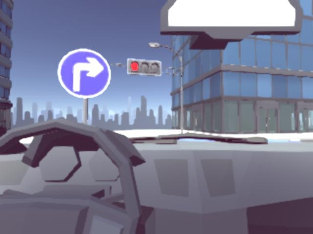

# 小车平台仿真实验

## 1 平台视图与基本操作

​	该实验仅需要同学打开如下网页，编辑/运行/调试代码即可。

* https://plrd-1251731927.cos-website.ap-shanghai.myqcloud.com/  该网址含有3种地图，其中第3幅地图含有主要元素：红绿灯/标志牌/行驶黄线/停止白线。4个视图分别为：全局俯视图，某角度侧视图，车顶俯视图 $view1$ , 车内视图 $view2$。

  

* https://plrdemo-1251731927.cos-website.ap-shanghai.myqcloud.com/ 该网址中第3幅地图仅含有元素：标志牌/行驶白线。4种视图同上。

  

### 1.1 具体步骤

* 解压代码包​。内容如图。请忽视 svm1.jpg, svm2.jpg 等图片。

  * maps --存放3种地图信息；

  * scripts --记录每次调试的代码，若太满可以视情况清空；

  * services-- 包含识别标志牌的py文件，线上调试代码框内代码开头需要引入该文件夹内文件；

    ```python
    from services.detection import detection
    from services.svm import SVM
    ```

  * app.py --配好环境后，直接运行。


* 安装好anaconda，打开终端，创建新环境drive并激活。( python版本后续可能提高，视情况而定 )

  ```python
  conda create -n drive python=3.7
  conda activate drive
  ```

* 为drive环境配置相关库。配置过程中若有报错，可以适当调整安装库的版本。

  ```python
  pip install -r requirements.txt
  ```

* 配置好环境后。直接运行app.py。

  ```
  conda activate drive
  python app.py
  ```

  

* 打开<https://plrd-1251731927.cos-website.ap-shanghai.myqcloud.com/>  网址。如下图，左边是代码编辑区，左下是调试信息打印区，旁边是复位/单步调试/连续运行，右侧是4个视图，可以放大。点击connect可连接后台。


​	右上角可以选择3种地图模式。第3幅地图包含要素较为齐全。


* 将左侧代码编辑区域内的代码替换为doubleline.py里的代码。点击连续运行或单步调试，小车跟着地上黄线进行巡迹，视觉效果为双线巡迹，实为沿黄线单线巡迹+吊缆车的方法。下图中，识别标志牌为“右转”。

  

  右转之后，在双线间直行。

  

### 1.2 函数解释

​	需要同学编辑 image_to_speed 函数，以实现小车遵守交通规则的行驶实验。

```python
import numpy as np
import cv2
from services.detection import detection  #引入标志牌识别所需文件
from services.svm import SVM #引入标志牌识别所需文件

# if you want print some log when your program is running, 
# just append a string to this variable
log = [] #可通过log.append()打印调试信息

def image_to_speed(view1, view2, state):
  """This is the function where you should write your code to 
  control your car.
  
  You need to calculate your car wheels' speed based on the views.
  
  Whenever you need to print something, use log.append().

  Args:
      view1 (ndarray): The left-bottom view, 
                        it is colorful, 3 * 120 * 160 
      #view1可在app.py中调整为彩色图或灰度图(1*120*160)
      
      view2 (ndarray): The right-bottom view, 
                        it is colorful, 3 * 480 * 640
      #view2的分辨率在两个网址中不同,巡白线网址中为3*240*320，黄线网址中为3*480*640
      
      state: your car's state, initially None, you can 
      #state 设置额外状态变量，可用于记录历史状态
             use it by state.set(value) and state.get().
             It will persist during continuous calls of
             image_to_speed. It will not be reset to None 
             once you have set it.
  Returns:
      (left, right): your car wheels' speed #输出左右轮速度，小车使用差速法调速。
```

## 2 标志牌识别

### 2.1 方法简介

​	实验使用hog+svm方案识别“右转”/“左转”/“直行”/"停止"标志牌。标志牌区域提取使用hsv特征筛选+最大轮廓提取。由于不同网址提供的图片分辨率不同，考虑日后实验图片分辨率也可能变化，提供调参经验。




### 2.2 调参经验

​	使用如下get_pixel.py代码，鼠标点击标志牌蓝色区域，获取H/S/V数值，多采一些路上遇到标志牌的样本图，寻找一组能够区别标志牌蓝色与背景的阈值。

```python
import cv2
import numpy as np
"""
This is a tool function to get the HSV parameters of an pixel by
the mouse click. Press "ESC" to quit.
"""
def show_HSV(event, x, y, flags, param):
    if event == cv2.EVENT_FLAG_LBUTTON:
        print(hsv[y, x, :])

img = cv2.imread("./pic/svm.jpg")
hsv = cv2.cvtColor(img, cv2.COLOR_BGR2HSV)
cv2.namedWindow('image')
cv2.setMouseCallback("image", show_HSV)
while (1):
    cv2.imshow("image", img)
    if cv2.waitKey(20) & 0xFF == 27:
        break
cv2.destroyAllWindows()
```

可用detection.py 和 sign.py 对采样图片进行测试。如下图，提取完蓝色部分，并进行膨胀( 膨胀结构元大小需要适当调整)。膨胀后提取最大轮廓及最大矩形坐标。


代码需要调整的部分大致在detection.py：

```python
self.H_low_thresh = 110 #hsv参数
self.H_high_thresh = 225 #hsv参数
self.S_low_thresh = 120 #hsv参数
self.V_low_thresh = 130 #hsv参数
self.aspect_ratio_thresh = 1.5 #扩大矩形框的比例
self.img_width = 320 #640 分辨率调整
self.img_height = 240 #480
```

以及detection.py中膨胀操作：

```python
element = cv2.getStructuringElement(cv2.MORPH_CROSS, (15, 15)) 
#结构元大小调整，观察是否能够将标志牌蓝色区域连通
```

以及detection.py中对标志牌区域大小的限制:

```python
# w,h的大小可调整,过小会导致--远距离错误识别
if w > 35 and h > 35 and aspect_ratio < self.aspect_ratio_thresh: 
	rects.append([rect[0], rect[1], rect[0] + rect[2], rect[1] + rect[3]])
```

识别效果为，框出标志牌区域，并输出识别信息：


## 3 单线巡迹

​	单线巡迹使用左下视图view1。若目标是识别地上的白线，view1可以使用灰度图，若目标是黄线，view1使用彩色图，可以使用“2.标志牌识别”小节中的get_pixel.py代码继续提取黄线与白线/背景不同的HSV特征，从而区别对待黄线和白线。

```python
hsv = cv2.cvtColor(view1, cv2.COLOR_BGR2HSV)
H, S, V = cv2.split(hsv)
cpx,cpy =np.where(S[50:70,:]>85)#巡黄色单线
if len(cpy) != 0:
    error = (np.array(cpy).mean() - 80.0)/80.0 #画面中线为第80列
    else:
    	error=0
```

​	单线巡迹的想法即：使车行驶切线方向，逼近黄线方向，使用pid调参思想调整左/右轮速度。一般情况下的pid差分公式为：
$$
u_k=u_{k-1}+K_p(e_k-e_{k-1})+K_ie_k+K_d(e_k+2e_{k-1}+e_{k-2})
$$
​	由于这里目前state参量只有一个，日后可以将state数量调多，方便记录历史状态，使速度调节更加丝滑。目前使用如下代码也可以满足需求。

```python
speed = 0.7
Kp = 1.3
SENSE = 1.0
left_speed = speed + Kp * error * SENSE
right_speed = speed - Kp * error * SENSE
```

* 然后，如果识别前方标志牌为直行，则可以调大速度，调小Kp，再使左右轮速度一致。
* 若识别前方标志牌为左转，则可以调小速度，调大Kp，再使左轮速度调小。
* 右转与上同理。

单线巡迹效果如下图。


## 4 双线巡迹

### 4.1 巡迹思路	

​	双线巡迹原本想寻找两边直线取中线，然后沿着中线进行单线巡迹。但是有停止白线的干扰，容易进行误别。然后采用继续沿着黄色线进行单线巡迹，只不过像类似缆车挂一根缆绳一样，使车始终与黄线有一段距离。即可营造一种双线巡迹的视觉感受。

​	如下图所示，寻找视野中黄线的边缘（蓝线标出），使用起点与终点（图中为红色小点）确定一条直线，然后使用点到直线距离公式找出蓝色线条右侧垂直平分线上的一点，该点距蓝线的距离固定，相当于“缆绳长度“。输出x0 即为找到的点的横坐标。

​	之后只要一直紧跟上述操作确定的点的轨迹，使车头行驶方向逼近该点轨迹即可。


​	小车沿车道右转过程如下图。


​	小车沿车道转完弯后，直行如下图。


### 4.2 左转注意事项

​	左转弯和右转弯有很大区别。右转弯相对简单直白，左转弯需要考虑在正确的车道上行驶，过程中需要跨越一道白线+2道黄线。


​	左转的思路：能看到左转指示牌时，直走。直到不能看到左转指示牌时，固定跟踪点的横坐标，执行固定次数，相当于方向盘持续向左打 7-8次，防止车看到前方三条黄线不知道跟着哪一条走。等执行了固定方向7-8次后，视野里将只会保留向左行的那条黄线。左转弯过程如下图所示。


​	左转弯流程如下图所示。


